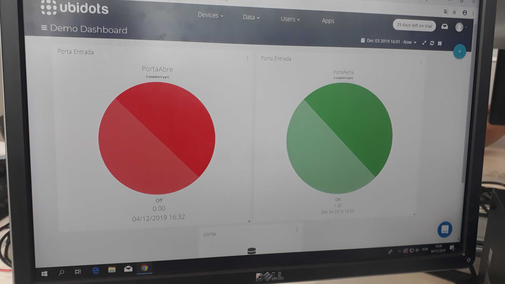

# ProjetoMicrocontroladores2Semestre
Repositório para o projeto de microcontroladores do 2 semestre de 2019

Utilização da plataforma SNIPS(como assistente de voz) e de um Raspberry PI, com o intuito de ligar um LED via comando de voz.

A utilização da plataforma SNIPS não funcionou como nós esperavamos devido à varios impecilios em relação à instalação do assistente SAM, assim desistimos de utiliza-lo e fizemos o funcionamento através de uma senha escrita, mandando o estado do LED para um dashboard no Ubidots.

Daniel Gustavo Sasaki   15.03176-4

Fabio Kawasaki 13.02838-3

André Chioratto 13.02642-9
